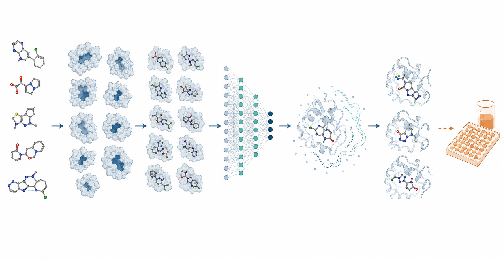

# AIRTI Target Fishing

<p align="center">
  
</p>

<p align="center"><em>图注：中央小分子进入开放蛋白结合口袋，外围节点网络和弧形轨迹分别表示 AI 复合物精评与分子动力学复核；图形表达计算候选生成，不表示实验靶点确认。</em></p>

AIRTI Target Fishing 是面向 1–5 个小分子的全人蛋白组反向钓靶内部计算流水线。首版主链为结构与口袋质控、QuickVina2 背景校准初筛、Boltz-2 精评、GROMACS 100 ns 分子动力学和分阶段共识排序。

项目只输出候选优先级与可追溯计算证据，不把纯计算结果表述为实验确认的直接靶点。



> 图注：图中从左到右表示 1–5 个查询小分子进入人源 canonical 蛋白结构与口袋库，依次经过背景校准的多种子批量对接、Boltz-2 多种子复合物精评和 GROMACS 分子动力学复核，最终形成少量可追溯候选，并转交独立湿实验验证。该图是目标生产流程示意，不表示全人蛋白组 ready 覆盖、100 ns MD 或湿实验靶点确认已经完成；当前通过范围以“当前阶段”和验证报告为准。

## 当前阶段

- 全人 canonical 蛋白清单、结构选择、口袋质控和配体准备的 Python 组件已实现；
- QuickVina2 三种子初筛、背景校准、Boltz-2 精评和 GROMACS 100 ns 复核适配器已实现；
- `prepare-ligands`、`screen`、`refine-boltz`、`run-md`、`render-report` 和 `evaluate-case` CLI 已桥接；`run-md` 可执行可溶与 POPC/CHL1 膜体系并分析真实轨迹；
- 分阶段共识排序、工件追溯和报告措辞门控已实现；Nextflow DSL2 已形成可恢复的编排骨架和模拟工具测试链；
- 现有 Docker/NVIDIA 蛋白质与多肽设计平台已审计并作为运行基础复用；
- QuickVina2、Boltz-2、CUDA GROMACS、AmberTools、PACKMOL-Memgen、MDAnalysis、fpocket 与 Meeko 已封装在同一固定版本镜像 `airti-tf:0.2.0-gpu`；
- 统一镜像已在当前 RTX 4090 节点通过真实 QuickVina2 搜索、Boltz-2 结构/亲和力推理和 1000 步 GROMACS GPU smoke，并通过任意非 root UID 缓存写入检查；
- 已冻结 UniProt 2026_02 reviewed human canonical 清单（20,416 条），并实现逐靶点断点、显式 unsupported/failed 状态和零静默丢失的全库构建门禁；
- 已加入 Nelfinavir 母体案例：CYP3A4/CYP3A5 金标准、四个银标准、64 蛋白工程面板和只在排名完成后读取锚点的评价器；
- HEM 对接模板保留原始 RCSB CCD 和受控变换 provenance；P450 的 100 ns MD 仍要求独立、经审计的 ferric-thiolate 参数适配器，缺失时失败关闭；
- EGFR 试点的 AmberTools/ParmEd/GROMACS 体系在修复微小电荷残差后完成最小化、100 ps NVT 和 500 ps NPT；该结果仅证明建模与平衡链路可运行，不代表 100 ns 生产 MD 已通过；
- 大数据与缓存计划分别使用 `/data/airti-target-fishing` 和 `/mnt/ssd4t/airti-target-fishing`。

研究依据、课题设计和实施规格分别见：

- [`ai-reverse-target-fishing/AI反向钓靶项目设计与课题调研报告.md`](ai-reverse-target-fishing/AI反向钓靶项目设计与课题调研报告.md)
- [`docs/superpowers/specs/2026-08-10-human-proteome-reverse-target-fishing-design.md`](docs/superpowers/specs/2026-08-10-human-proteome-reverse-target-fishing-design.md)
- [`docs/environment/2026-08-12-existing-platform-audit.md`](docs/environment/2026-08-12-existing-platform-audit.md)
- [`docs/validation/v0.1.0-hardware-smoke-report.md`](docs/validation/v0.1.0-hardware-smoke-report.md)
- [`docs/validation/v0.1.0-orchestration-smoke-report.md`](docs/validation/v0.1.0-orchestration-smoke-report.md)
- [`docs/validation/2026-08-13-egfr-adapter-pilot.md`](docs/validation/2026-08-13-egfr-adapter-pilot.md)
- [`cases/nelfinavir/README.md`](cases/nelfinavir/README.md)
- [`docs/operations/runbook.md`](docs/operations/runbook.md)

## 开发入口

```bash
python -m venv --system-site-packages .venv
.venv/bin/pip install --no-deps -e .
.venv/bin/pytest -q
.venv/bin/ruff check src tests
.venv/bin/python -m mypy src/airti_tf
.venv/bin/airti-tf version
```

Nextflow 的 `test` profile 使用模拟工具验证 DAG、交付目录与 `-resume`，不消耗 GPU：

```bash
./scripts/run_orchestration_smoke.sh
```

该脚本将 10 个查询分成两个 5 分子批次，验证六阶段身份传递、报告哈希、unsupported 缺失值语义和无重算恢复。输出带有 `orchestration_mock_only` 标志，不产生真实靶点排序。

## 统一镜像与硬件 smoke

```bash
docker build -f containers/airti.Dockerfile -t airti-tf:0.2.0-gpu .
./scripts/run_hardware_smoke.sh
```

镜像内容标识、工具版本、SBOM 和模型检查点哈希见 `containers/images.lock.yaml`、`containers/models.lock.yaml` 与 `docs/sbom/`。模型和 CCD 数据不写入镜像，默认缓存在 `/mnt/ssd4t/airti-target-fishing/boltz`。

生产运行必须先执行：

```bash
airti-tf preflight --profile production --output preflight.json
```

当前通过的是统一工具链、GPU 执行路径、可恢复编排、EGFR 单 ready 靶点试点和 Nelfinavir 案例的工程资产门禁，不等同于 20,416 靶点构建或 Nelfinavir 全流程已经完成，也不构成靶点确认。进入无人值守生产前仍需完成冻结全库、Nelfinavir 64 面板与全库实算、经审计的 P450 HEM MD 参数适配器，以及 10 例真实检索基准。单次生产任务仅支持 1–5 个查询分子。
