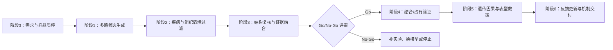

# AI 反向钓靶：方法调研、服务课题设计与实施流程

> **项目定位**：本项目首先是靶点发现与验证服务，而非以刷新算法榜单为目标的方法学竞赛。成熟算法与已有平台可以直接复用；项目价值取决于能否把客户的活性化合物和表型线索转化为可核查的候选靶点、实验决策与机制证据链。

## 摘要

本报告将“AI 反向钓靶”界定为：以具有可重复生物学表型、但直接作用靶点未知或不完整的小分子为起点，综合配体相似性、药物—靶点知识、扰动组学、疾病网络、组织表达和蛋白结构信息，生成候选靶点优先级，并通过靶标结合、细胞内靶标占有、遗传扰动和表型救援形成机制闭环。调研表明，配体中心预测、全蛋白组反向对接、多模态药物—靶点相互作用预测和化学蛋白质组学均已有成熟工作；这对服务型课题并非不利，反而提供了可复用模块与现实基线。现有证据同时说明，单一对接分数或单一模型概率不能证明直接靶点，结构筛选更适合作为候选富集层，最终结论需要正交实验。基于此，报告提出“需求与样品质控—多路候选生成—情境过滤—证据融合—分级实验—反馈更新—机制交付”的七阶段流程，并给出三档服务包、最小可行试点、评价指标、停止规则和可扩展课题。建议先用已知阳性对照完成盲法回溯验证，再进入一个真实未知靶点案例；首轮目标不是宣称唯一靶点，而是把候选空间压缩到可实验验证的规模，并形成可追溯的证据卡。

**关键词**：反向钓靶；靶点去卷积；人工智能；反向对接；化学蛋白质组学；表型筛选；作用机制

## 1. 概念边界与参考服务解析

### 1.1 本报告所称“反向钓靶”

常见药物研发任务容易被同一个“筛选”术语混淆，实际输入和输出不同：

| 任务 | 输入 | 输出 | 本项目是否覆盖 |
|---|---|---|---|
| 正向虚拟筛选 | 已知靶蛋白 | 候选化合物 | 仅作为后续扩展 |
| 计算反向钓靶 | 已知小分子 | 排序后的候选蛋白 | 核心计算任务 |
| 表型靶点去卷积 | 小分子 + 可重复表型 | 直接靶点、通路与因果链 | 核心完整任务 |
| 脱靶/安全性分析 | 候选药物 | 潜在非预期靶点 | 可选服务支线 |
| 老药新用 | 已知药物 | 新靶点、新适应证或机制 | 可选应用场景 |

因此，本项目的标准输入不是“一个结构式”这么简单，而应至少包括化合物结构与批次信息、活性浓度、表型读出、细胞或组织模型、对照组及已知机制线索。标准输出也不应只是对接图片，而应包括候选靶点排名、每个靶点的证据来源、相互矛盾的证据、适用域/不确定性、验证实验和结论等级。

### 1.2 对 DenovoPro 技术服务页面的参考与修正

截至 2026-08-10，DenovoPro 页面将相关栏目命名为“药物虚拟筛选（化合物筛选）/反向找靶（老药新用）”，其展开流程主要是：准备一个**已知靶蛋白**的 PDB 或 AlphaFold 结构，经 QuickVina 2/AutoDock Vina 粗筛至 Top 200，再用 Boltz-2 精筛至 Top 30，随后进行 AlphaFold 综合评估和可选的 100 ns GROMACS 模拟；交付物包括对接数据、Excel、报告和可视化。页面也明确表示最终以湿实验为准（[DenovoPro, 2026](https://www.denovopro.cn/tech-services.html)）。

该流程适合“已知靶点找化合物”，但与“给定化合物寻找未知靶点”的输入—输出方向并不完全相同。本项目保留其可借鉴的分层筛选思想、结构质控、Top-k 递进和标准化交付，同时作三项扩展：

1. 在结构筛选之前加入配体相似性、知识图谱、扰动组学、疾病网络和组织表达等候选生成路线；
2. 把对接或复合物预测限定为证据之一，不把分数直接解释为结合概率或作用机制；
3. 将化学蛋白质组学、细胞内靶标占有和遗传救援纳入核心闭环，而非仅作为外围建议。

页面关于命中率、速度或模型精度的宣传性数字未在本报告中作为独立事实采用；本项目的阈值应由阳性对照、盲测和实际实验数据重新标定。

## 2. 文献格局：哪些方法可以直接用于服务

### 2.1 配体中心与机器学习反向筛选

配体中心方法依据“结构或表征相近的分子往往共享部分生物活性”生成候选靶点。SwissTargetPrediction、PLATO 与 STarFish 分别代表相似性反向筛选、平台化生物活性画像和面向天然产物的集成模型（Daina et al., 2019；Ciriaco et al., 2022；Cockroft et al., 2019）。STarFish 在随机交叉验证与天然产物外部集之间出现明显性能下降，同时集成模型又改善了外部集表现，说明服务流程既要利用集成，也要显式检查客户化合物是否超出训练化学空间（[Cockroft et al., 2019](https://doi.org/10.1021/acs.jcim.9b00489)）。

Daina 与 Zoete 使用大规模外部集合检验反向筛选，并强调应用导向、非重叠数据集的重要性；Mathai 等则指出，仅报告总体性能会掩盖不同骨架和靶点家族的偏倚（[Daina & Zoete, 2024](https://doi.org/10.1038/s42004-024-01179-2)；[Mathai et al., 2019](https://doi.org/10.1093/bib/bbz026)）。对服务项目而言，这意味着报告必须同时给出排名和适用域，而不是输出一个看似精确但未经校准的“结合概率”。

### 2.2 多模态与不确定性建模

MDTips 融合知识图谱、基因表达和药物/靶点结构信息；其报告结果表明，多模态整合可作为候选生成骨干，但该结论仍受数据集和评测设置约束（[Xia et al., 2023](https://doi.org/10.1093/bioinformatics/btad411)）。MAI-TargetFisher 进一步结合 AI 与物理模型，在人蛋白结构空间中进行广覆盖扫描，是与本项目最接近的现成框架之一（[Li et al., 2025](https://doi.org/10.1038/s41401-024-01444-z)）。本项目无需回避这些工作，可把它们作为工具、基线或交叉复核来源。

EviDTI 将证据深度学习用于预测不确定性，并开展了前瞻性结合验证，说明“候选分数 + 不确定性”比单独排序更适合决定实验优先级（[Zhao et al., 2025](https://doi.org/10.1038/s41467-025-62235-6)）。但其结果不能自动迁移到任意客户化合物；本项目应保留模型间分歧、数据覆盖度和拒判状态。

### 2.3 全蛋白组反向对接与结构筛选

反向对接的优势是可以处理缺少已知相似配体的化合物，并提供可解释的结合口袋和残基假设。其限制同样明确：Luo 等将位点预测、对接和重打分组成 11 条人蛋白组流程，最佳流程的 Top-100 命中率为 27.8%，提示它适合缩小空间而不适合单独定靶（[Luo et al., 2024](https://doi.org/10.1002/pro.5167)）。对十种对接程序的系统评估也发现，许多程序可以找到合理构象，却难以在全数据集上准确排序结合亲和力（[Wang et al., 2016](https://doi.org/10.1039/C6CP01555G)）。因此，本项目只对经生物学情境过滤后的候选蛋白进行结构复核，避免无差别全蛋白计算把噪声放大。

### 2.4 实验靶点去卷积与机制确认

化学蛋白质组学可分为需要探针修饰的富集/光亲和路线，以及不改造母体分子的无标记路线。LiP-Quant 将有限蛋白水解、质谱和机器学习结合，可同时给出候选靶点及近似结合区域（[Piazza et al., 2020](https://doi.org/10.1038/s41467-020-18071-x)）。无标记方法还包括 CETSA/TPP、DARTS、稳定性或溶解性变化等，适合担心衍生化改变活性的化合物（[Sun et al., 2021](https://doi.org/10.1002/med.21788)）。光亲和标记能在原生环境中直接捕获相互作用，但需要认真验证探针活性、竞争特异性和连接臂影响（[Homan et al., 2024](https://doi.org/10.1038/s43586-024-00308-4)）。

严格的小分子探针验证需要同时考虑细胞效力、选择性、靶标占有与功能生物标志物；细胞表型不能仅凭一个体外结合结果归因于某个蛋白（[Vu et al., 2022](https://doi.org/10.1146/annurev-biochem-032620-105344)）。CETSA 筛选和细胞内占有测定说明，直接结合最好在接近生理环境的细胞体系中复核（[Almqvist et al., 2016](https://doi.org/10.1038/ncomms11040)；[Robers et al., 2020](https://doi.org/10.1146/annurev-biochem-011420-092302)）。

### 2.5 方法选择矩阵

| 方法层 | 典型输入 | 主要输出 | 优点 | 主要风险 | 建议角色 |
|---|---|---|---|---|---|
| 配体相似性/传统 ML | 结构式、已知活性数据库 | 相似配体支持的靶点 | 快、成本低、便于解释 | 新骨架与数据稀疏靶点失效 | 第一轮候选生成 |
| 多模态 DTI/知识图谱 | 结构、序列、知识、表达 | 跨模态候选及关系路径 | 可整合异质证据 | 数据泄漏、知识热门度偏倚 | 第二路候选生成 |
| 表型/扰动组学 | 转录组、形态组、疾病签名 | 通路、作用方向、相似扰动 | 贴近客户表型 | 多为间接机制 | 情境过滤与机制解释 |
| 反向对接/复合物预测 | 化合物与候选蛋白结构 | 口袋、构象、结构分数 | 可处理无相似配体案例 | 口袋、构象与评分误差 | Top 100–300 结构复核 |
| 分子动力学/自由能近似 | 少量复合物 | 稳定性与相互作用轨迹 | 细化结合假设 | 计算成本高，仍非实验证据 | Top 3–10 深化 |
| 化学蛋白质组学 | 化合物、细胞/裂解液 | 蛋白组候选与结合位点 | 直接面向真实蛋白环境 | 丰度、非特异吸附与探针偏差 | 独立证据主轴 |
| 生化/生物物理 | 纯化蛋白与化合物 | 亲和力、动力学或酶活 | 定量、可重复 | 可能脱离细胞环境 | 直接结合确认 |
| 细胞占有 + 遗传学 | 细胞、CRISPR/救援体系 | 细胞内结合与因果性 | 能连接靶点与表型 | 补偿、毒性与模型依赖 | 机制定论关键层 |

## 3. 推荐课题与服务产品定义

### 3.1 推荐总课题

**面向表型活性小分子的多证据 AI 反向钓靶与正交验证服务体系。**

中心问题不是“能否发明一个新的 DTI 网络”，而是：在客户提供的真实化合物、真实表型和有限实验预算下，如何稳定地把全蛋白空间压缩为可验证的候选集合，并用预先约定的证据标准区分“计算提示”“发生结合”“细胞内占有”和“因果靶点”。

### 3.2 可拆分的服务型子课题

| 编号 | 课题方向 | 适用客户/样本 | 主要交付 | 难度 |
|---|---|---|---|---|
| T1 | 天然产物/中药单体反向钓靶 | 新骨架、已知表型 | 多模型候选 + 天然产物适用域 + 验证清单 | 中高 |
| T2 | 表型筛选命中物靶点去卷积 | 细胞筛选 hit | 候选靶点 + 化学蛋白组 + 遗传救援 | 高 |
| T3 | 已上市药物脱靶与毒性解释 | 药物或临床候选 | 潜在脱靶、组织风险、优先实验 | 中 |
| T4 | 老药新用的靶点—通路—疾病链 | 已知药物与疾病模型 | 新靶点证据卡、疾病网络与验证 | 中 |
| T5 | 化学蛋白质组学数据的 AI 再排序 | 已有 TPP/CETSA/LiP-MS 数据 | 差异蛋白过滤、靶点排序、机制网络 | 中 |
| T6 | 机制未知活性分子的全闭环服务 | 数据较完整、预算较足 | 从计算到直接靶点与表型救援 | 最高 |

若作为一个可持续服务产品，建议以 T2/T6 为旗舰、T1 为高需求入口、T3/T4 为复用已有药物知识的快速包、T5 为合作实验室的分析增值包。

## 4. 项目设计流程



### 4.1 阶段 0：需求澄清与可行性闸门

**必需输入**：标准化结构（含立体化学、盐型）、样品纯度与溶解性、活性浓度和剂量—反应、表型模型、阴阳性对照、预期疾病/通路范围、已知类似物及可用样本。

**先决检查**：

- 独立批次能否重复表型；
- 表型是否发生在明显细胞毒性之前；
- 化合物是否聚集、荧光干扰或具有广谱反应性；
- 活性是否依赖特定细胞、时间窗或代谢条件；
- 是否允许化学衍生化，是否有足够样品用于质谱和生物物理实验。

若表型不能重复，或有效浓度与非特异毒性重叠，则先解决样品和实验问题，不启动大规模钓靶。这是首个 No-Go 闸门。

### 4.2 阶段 1：多路独立候选生成

不让单一模型决定候选池，至少保留四条相对独立的证据路线：

1. **配体中心路线**：SwissTargetPrediction、PLATO、STarFish 或本地 ChEMBL/BindingDB 相似性与分类模型；
2. **多模态/知识路线**：药物—靶点—疾病知识图谱、蛋白序列/结构表征、公开 DTI 模型；
3. **表型路线**：转录扰动、Cell Painting 或客户组学与公共扰动签名匹配，先定位通路和作用方向；
4. **实验先验路线**：若客户已有 CETSA/TPP、pull-down、蛋白质组或抗性突变数据，直接转成候选与权重。

各路线先独立输出排名及原始证据，再取并集。缺失某一模态不记为负证据，以免系统性排除数据稀疏的新靶点。

### 4.3 阶段 2：生物学情境过滤

候选蛋白必须接受与项目场景相关的过滤：

- 在目标细胞/组织中是否表达，亚细胞定位是否允许接触；
- 靶点所在通路能否解释观察到的表型和时间尺度；
- 遗传依赖性、疾病关联和已知安全性是否一致；
- 药物浓度、细胞通透性和代谢产物是否支持该机制；
- 是否存在更简单的替代解释，例如膜扰动、线粒体毒性或广谱共价反应。

输出不只保留“支持项”，还要记录关键冲突。一个结构得分很高但目标细胞不表达的蛋白应被降级，而不是靠调权重继续留在榜首。

### 4.4 阶段 3：结构复核与证据融合

建议将情境过滤后的约 100–300 个蛋白送入口袋识别、反向对接和复合物重评分；对 Top 10–30 做人工结构审查，对 Top 3–10 再考虑多构象对接、分子动力学或更高成本计算。具体数量根据蛋白家族、结构质量和预算调整，不作为通用性能阈值。

证据融合优先采用透明的秩聚合，而非直接把异质分数相加。设第 (m) 个证据模态对靶点 (t) 的百分位排名为 (p_m(t)\in[0,1])，覆盖指示为 (a_m(t))，则基础综合分为：

\[
R(t)=\frac{\sum_m w_m a_m(t)p_m(t)}{\sum_m w_m a_m(t)}+\gamma C(t)-\lambda U(t)-\rho F(t),
\]

其中 (C(t)) 表示细胞/疾病情境一致性，(U(t)) 表示模型分歧与适用域不确定性，(F(t)) 表示结构质量差、非特异风险或证据冲突等红旗。权重应在阳性对照上预先确定，并在客户盲样揭盲前锁定。报告同时给出：综合排名、单模态排名、证据覆盖、冲突和“建议验证/证据不足/拒判”状态。

### 4.5 阶段 4：靶标结合与细胞内占有

实验路线根据化合物性质选择，而不是每个项目机械地做同一组实验：

| 目标 | 首选方法 | 关键对照 | 阳性判据 |
|---|---|---|---|
| 纯化蛋白直接结合 | SPR、BLI、MST、ITC、DSF | 无关蛋白、溶剂、类似物 | 可重复、浓度依赖且模型拟合合理 |
| 酶/受体功能 | 酶活、配体置换、信号读出 | 阳性抑制剂、失活蛋白 | 活性与结合浓度区间相容 |
| 无标记蛋白组去卷积 | CETSA/TPP、DARTS、LiP-MS | 多剂量、竞争、重复批次 | 蛋白稳定性/切割变化可重复 |
| 原生环境捕获 | 光亲和/点击化学 pull-down | 母体竞争、失活探针、珠子对照 | 富集被母体化合物剂量依赖竞争 |
| 细胞内靶标占有 | CETSA、NanoBRET 等 | 细胞活力、阴性化合物 | 占有随浓度和时间变化 |

对可能存在活性代谢物的项目，必须比较母体与代谢条件，否则“体外不结合、细胞有效”不应被简单视为模型失败。

### 4.6 阶段 5：遗传因果、救援与机制闭环

直接结合不等同于表型因果。对 1–3 个高优先靶点开展 CRISPR knockout/CRISPRi、siRNA 或过表达，并检验：

1. 靶点降低是否模仿化合物表型；
2. 靶点降低是否改变化合物敏感性；
3. 野生型或耐药突变体回补能否救援；
4. 下游通路标志物是否按预测方向变化；
5. 结构类似物的构效关系是否在结合、占有和表型三层一致。

本项目建议采用如下操作性结论等级：

| 等级 | 允许表述 | 最低证据 |
|---|---|---|
| L0 | 计算候选靶点 | 至少两条计算路线或一条强实验先验 |
| L1 | 可能发生直接结合 | 一项可重复生化/生物物理或蛋白组结合证据 |
| L2 | 细胞内靶标占有 | 细胞内剂量依赖占有/稳定性变化 |
| L3 | 表型相关靶点 | 遗传扰动改变表型或药物敏感性 |
| L4 | 高可信直接作用靶点 | 物理结合 + 细胞占有 + 遗传因果，最好有竞争或耐药突变救援 |

只有达到 L4，服务报告才使用“高可信直接作用靶点”；L0–L3 应保留限定语。

### 4.7 阶段 6：反馈更新与交付

实验结果反馈到证据矩阵：阳性结果提升同家族、同口袋或同通路候选的优先级；阴性结果用于识别适用域和系统性误差，但不能把一次技术失败直接当作真实负样本。每轮后召开 Go/No-Go 评审，决定继续扩大靶点、切换实验路线、检查代谢物，或停止项目。

## 5. 三档服务包与交付物

### 5.1 S1：计算优先级包

适合样品少、需要先判断方向的项目。交付：

- 化合物与表型输入质控单；
- 多路候选生成结果及 Top 20–50 综合列表；
- Top 10 靶点证据卡：支持、反对、适用域、结构图与验证建议；
- 疾病/通路网络和潜在脱靶提示；
- 原始表格、参数、数据源版本和可复现脚本/环境说明。

计算包只交付“候选”，不交付“已确认靶点”。

### 5.2 S2：靶标结合确认包

在 S1 基础上，选择 5–10 个候选开展一种蛋白组级方法或若干靶向生物物理/生化实验，交付 L1/L2 证据、阴阳性对照、原始曲线和下一轮决策。若客户化合物不适合衍生化，优先选择无标记路线。

### 5.3 S3：机制闭环包

在 S2 基础上，对 1–3 个靶点完成细胞占有、遗传扰动、救援和通路标志物验证，形成“化合物—直接靶点—通路—表型”证据链。该包才以达到 L4 为目标；如果结果否定最初假设，交付可审计的否定证据和后续分支，而不强行生成确定结论。

### 5.4 标准交付目录

```text
project/
├── 00_intake/               # 样品、表型、批次和需求冻结
├── 01_data_qc/              # 结构、数据库与实验数据质控
├── 02_candidate_generation/ # 各独立模型原始结果
├── 03_evidence_fusion/      # 排名、覆盖度、不确定性与冲突
├── 04_structure_review/     # 口袋、构象、残基和结构质控
├── 05_experiments/          # 方案、原始数据、统计与复核
├── 06_target_cards/         # 每个候选的一页证据卡
└── 07_final_report/         # 结论等级、限制和下一步
```

## 6. 最小可行试点（MVP）

建议用“三类样本、两次冻结、一次盲测”启动：

1. **阳性对照 A**：经典药物，主靶点和占有实验成熟，用于检查全流程是否能找回；
2. **阳性对照 B**：多靶点或天然产物，用于检查多药理和适用域；
3. **真实案例 C**：客户的未知靶点化合物，计算团队在实验前冻结 Top-k 与证据卡。

第一次冻结发生在看到实验结果前，固定数据库快照、模型、权重和候选列表；第二次冻结发生在首轮实验后，记录哪些更新来自新证据。已知对照应尽量从训练数据库中做时间或记录隔离，防止简单记忆被误当作预测能力。

### 6.1 MVP 成功标准

- 阳性对照的已知靶点进入预先约定的 Top-k；
- 候选卡能够解释为何入选、为何被降级，以及缺失了什么证据；
- 未知案例至少获得一个可重复的 L1/L2 信号，或得到足以支持停止/改路的明确阴性结果；
- 全过程可以从最终结论追溯到原始模型输出和实验批次；
- 对低覆盖或高分歧案例允许拒判，不以强行给出 Top 1 为成功标准。

### 6.2 评价指标

| 维度 | 指标 | 用途 |
|---|---|---|
| 排序 | Recall@5/10/20、MRR、富集因子 | 检查能否缩小实验范围 |
| 泛化 | 随机、骨架冷启动、靶点冷启动、时间切分 | 暴露记忆与分布外失效 |
| 置信度 | Brier/ECE、风险—覆盖曲线、拒判率 | 判断分数是否可用于决策 |
| 实验 | 结合/占有阳性率、重复一致性、救援成功 | 衡量真实服务价值 |
| 运营 | 周转时间、单个高可信靶点成本、补实验率 | 优化服务流程 |
| 可追溯 | 数据版本、参数、日志、原始曲线完整率 | 支持复核与合规 |

时间与成本应在明确实验组合后估算。作为内部排期假设，可将 S1 设计为数周级、S2 设计为两至三个月级、S3 设计为数月至半年级；这些是资源规划范围，不是文献支持的固定周期，也不应对外承诺为统一交付时限。

## 7. 关键风险、控制与停止规则

| 风险 | 可能造成的错误 | 预防/控制 | 停止或转向条件 |
|---|---|---|---|
| 化学空间外推 | 新骨架被错误高置信排序 | 相似度/距离、模型分歧、天然产物专门基线 | 全部模型均域外时转向蛋白组实验 |
| 数据泄漏 | 回溯指标虚高 | 时间切分、骨架冷启动、锁定数据库快照 | 无法隔离训练记录时不宣称盲测性能 |
| 热门靶点偏倚 | 知识丰富蛋白反复居前 | 覆盖度校正、阴性证据、探索名额 | 榜单被少数家族支配时强制多样化 |
| 结构质量/口袋错误 | 对接假阳性 | PDB 优先、多构象、口袋与残基人工复核 | 关键口袋低可信时不进入高成本模拟 |
| 把对接分数当亲和力 | 机制过度解释 | 秩用途、共识筛选、生物物理确认 | 无正交证据时最高只到 L0 |
| 化合物聚集/反应性 | 广谱假靶点 | 去垢剂/聚集控制、反应性与干扰检查 | 表型仅在非特异条件出现则暂停 |
| 探针修饰改变活性 | pull-down 靶点失真 | 母体竞争、探针活性复核、多连接位点 | 探针失活时切换无标记法 |
| 遗传补偿或必需基因效应 | 因果判断失真 | CRISPRi/急性降解、多个 sgRNA、救援 | 遗传效应与药理方向长期矛盾则重开假设 |
| 活性代谢物 | 母体体外阴性 | 代谢条件、时间序列、代谢物分析 | 细胞有效而所有母体结合阴性时查代谢物 |
| 多靶点机制 | 强求唯一靶点 | 组合扰动、通路层模型、分级表述 | 单靶点不能解释表型时转为多靶点模型 |

## 8. 证据支持、冲突与“撞车”的服务化解释

### 8.1 证据较强的三条主张

**C1：多模态融合适合作为候选排序骨干，但并非在所有域中必然优于单模态。** MDTips 和 EviDTI 直接支持多模态与不确定性在 DTI 排序中的可用性；天然产物外部验证的性能落差则要求保留适用域限制。结论强度：**中等支持，需场景验证**。

**C2：候选靶点需要物理结合、细胞占有和功能因果的正交证据。** 化学探针验证、细胞靶标占有、CETSA 和化学蛋白质组学文献形成一致证据链。结论强度：**强支持**。

**C3：对接与复合物评分适合候选富集，不能单独证明直接靶点。** 人蛋白组反向对接与通用对接基准均显示评分和排序存在明显边界。结论强度：**强支持**。

### 8.2 邻近工作不是项目障碍

MAI-TargetFisher 与“AI + 物理模型的全蛋白组靶点扫描”高度接近；MDTips、PLATO、SwissTargetPrediction、STarFish 和反向对接基准覆盖了主要计算组件。若目标是算法论文，单纯拼接这些模块的创新风险较高；但在本项目的服务定位下，它们提供了三类价值：现成候选源、外部交叉复核和最低性能基线。服务差异应来自客户场景建模、证据追溯、实验闭环、交付标准和累计案例库，而不必强行包装为新网络结构。

## 9. 数据与工具建议

建议采用“公共数据可追溯、商业数据合规、模型可替换”的架构：

- **化学与活性**：ChEMBL、BindingDB、PubChem；商业数据库按许可证使用；
- **蛋白与结构**：UniProt、PDB、AlphaFold DB，记录结构来源、构象和置信度；
- **疾病与通路**：Open Targets、Reactome、STRING、GWAS/eQTL 等；
- **组织与依赖性**：GTEx、Human Protein Atlas、DepMap 等；
- **扰动与表型**：客户转录组/蛋白组、公共扰动签名、Cell Painting；
- **计算模块**：RDKit/指纹与图模型、公开 target-fishing 服务、多模态 DTI、AutoDock Vina/同类对接、必要时的复合物预测和 MD；
- **实验模块**：TPP/CETSA/LiP-MS、光亲和捕获、SPR/BLI/MST/ITC、NanoBRET、CRISPRi/KO 与救援。

数据库和在线服务会持续更新，正式项目必须在启动时冻结版本、下载日期、许可证和模型权重；本表只定义类别，不把 2026-08-10 的可用状态视为永久承诺。

## 10. 决策建议

1. **把产品名称定义清楚**：计算包称“候选靶点优先级服务”，只有全闭环包才称“靶点去卷积/机制确认”。
2. **先建评测与证据标准，再扩模型**：用两个阳性对照和一个盲样完成 MVP，固定 L0–L4 口径。
3. **成熟方法优先复用**：现有 target-fishing、DTI 与结构模型组成模型池；资源优先投入输入质控、实验接口、证据卡和案例数据库。
4. **实验选择由化合物决定**：可衍生化分子可考虑光亲和；活性易受修饰影响者优先无标记蛋白质组；有明确候选蛋白时优先靶向结合与细胞占有。
5. **允许多靶点和拒判**：天然产物、表型筛选命中物和高浓度效应尤其不应预设唯一靶点。高质量的“证据不足/需要代谢物路线”比虚假的 Top 1 更有服务价值。
6. **形成两个知识资产**：一是可复用的靶点证据图谱，二是计算预测—实验结果配对的内部案例库。后者可在样本积累后用于校准和主动选择实验，届时再考虑方法学论文。

## 11. 调研方法与局限

本次调研以 2026-08-10 为证据截止日，执行了 19 组不同查询（另有一次对接限制检索重试），覆盖字面表述、方法、问题、预期结论、相邻领域、可能标题、前瞻验证、闭环实验、数据泄漏、反向对接限制及三条核心主张。检索结果按 DOI 去重，并对最终候选的 20 个 DOI 通过 Crossref 核验题名和年份。报告优先使用同行评议原创研究、方法基准和高质量综述；厂商网页只用于解析服务流程，其宣传性性能数字不作为独立学术证据。

本报告不是符合 PRISMA 的系统综述，未穷尽中文数据库、专利、付费行业报告和未公开项目；检索平台对 2026 年新近条目的收录也可能不完整。候选方法的实际可用性、许可证、算力和实验成本需在具体客户项目中再次核对。文献中的平均性能不能直接外推到某一个化合物。

## 参考文献

Almqvist, H., et al. (2016). CETSA screening identifies known and novel thymidylate synthase inhibitors and slow intracellular activation of 5-fluorouracil. *Nature Communications, 7*, 11040. https://doi.org/10.1038/ncomms11040

Ciriaco, F., Gambacorta, N., Trisciuzzi, D., & Nicolotti, O. (2022). PLATO: A predictive drug discovery web platform for efficient target fishing and bioactivity profiling of small molecules. *International Journal of Molecular Sciences, 23*(9), 5245. https://doi.org/10.3390/ijms23095245

Cockroft, N. T., Cheng, X., & Fuchs, J. R. (2019). STarFish: A stacked ensemble target fishing approach and its application to natural products. *Journal of Chemical Information and Modeling, 59*(11), 4906–4920. https://doi.org/10.1021/acs.jcim.9b00489

Daina, A., Michielin, O., & Zoete, V. (2019). SwissTargetPrediction: Updated data and new features for efficient prediction of protein targets of small molecules. *Nucleic Acids Research, 47*(W1), W357–W364. https://doi.org/10.1093/nar/gkz382

Daina, A., & Zoete, V. (2024). Testing the predictive power of reverse screening to infer drug targets, with the help of machine learning. *Communications Chemistry, 7*, 98. https://doi.org/10.1038/s42004-024-01179-2

DenovoPro. (2026). *AI 生物计算技术服务：化合物筛选/反向找靶*. Retrieved August 10, 2026, from https://www.denovopro.cn/tech-services.html

Gao, Y., Ma, M., Li, W., & Lei, X. (2023). Chemoproteomics, a broad avenue to target deconvolution. *Advanced Science, 11*(6), 2305608. https://doi.org/10.1002/advs.202305608

Homan, R. A., et al. (2024). Photoaffinity labelling with small molecules. *Nature Reviews Methods Primers, 4*, 30. https://doi.org/10.1038/s43586-024-00308-4

Li, S.-W., et al. (2025). MAI-TargetFisher: A proteome-wide drug target prediction method synergetically enhanced by artificial intelligence and physical modeling. *Acta Pharmacologica Sinica, 46*, 1222–1234. https://doi.org/10.1038/s41401-024-01444-z

Luo, Q., Wang, S., Li, H. Y., Zheng, L., Mu, Y., & Guo, J. (2024). Benchmarking reverse docking through AlphaFold2 human proteome. *Protein Science, 33*(9), e5167. https://doi.org/10.1002/pro.5167

Mathai, N., Chen, Y., & Kirchmair, J. (2019). Validation strategies for target prediction methods. *Briefings in Bioinformatics, 21*(3), 791–802. https://doi.org/10.1093/bib/bbz026

Peón, A., Dang, C. C., & Ballester, P. J. (2016). How reliable are ligand-centric methods for target fishing? *Frontiers in Chemistry, 4*, 15. https://doi.org/10.3389/fchem.2016.00015

Peón, A., Naulaerts, S., & Ballester, P. J. (2017). Predicting the reliability of drug-target interaction predictions with maximum coverage of target space. *Scientific Reports, 7*, 3820. https://doi.org/10.1038/s41598-017-04264-w

Piazza, I., et al. (2020). A machine learning-based chemoproteomic approach to identify drug targets and binding sites in complex proteomes. *Nature Communications, 11*, 4200. https://doi.org/10.1038/s41467-020-18071-x

Robers, M. B., et al. (2020). Quantifying target occupancy of small molecules within living cells. *Annual Review of Biochemistry, 89*, 557–581. https://doi.org/10.1146/annurev-biochem-011420-092302

Sun, J., et al. (2021). Recent advances in proteome-wide label-free target deconvolution for bioactive small molecules. *Medicinal Research Reviews, 41*(5), 2893–2926. https://doi.org/10.1002/med.21788

Vu, V., Szewczyk, M. M., Nie, D. Y., Arrowsmith, C. H., & Barsyte-Lovejoy, D. (2022). Validating small molecule chemical probes for biological discovery. *Annual Review of Biochemistry, 91*, 301–333. https://doi.org/10.1146/annurev-biochem-032620-105344

Wang, Z., et al. (2016). Comprehensive evaluation of ten docking programs on a diverse set of protein–ligand complexes: The prediction accuracy of sampling power and scoring power. *Physical Chemistry Chemical Physics, 18*, 12964–12975. https://doi.org/10.1039/C6CP01555G

Xia, X., Zhu, C., Zhong, F., Liu, L., & Martelli, P. L. (2023). MDTips: A multimodal-data-based drug–target interaction prediction system fusing knowledge, gene expression profile, and structural data. *Bioinformatics, 39*(7), btad411. https://doi.org/10.1093/bioinformatics/btad411

Zhao, Y., et al. (2025). Evidential deep learning-based drug-target interaction prediction. *Nature Communications, 16*, 6976. https://doi.org/10.1038/s41467-025-62235-6

---

**AI 使用披露**：本报告使用 AI 辅助文献检索、来源核验、证据综合与草拟。所有核心文献均以 DOI 元数据核验；关于具体项目的最终方案、实验执行和结论等级仍需由领域专家与项目负责人审核。

**字数说明**：正文为完整项目设计型研究报告；未将检索 JSON、HTML 辅助报告和 BibTeX 附件计入正文。
