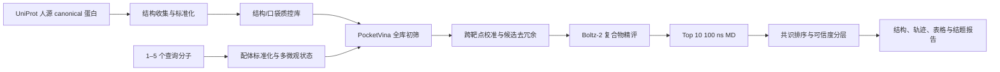

# 全人蛋白组 AI 反向钓靶三级计算流水线设计规格

**状态**：已由用户确认，可进入实施计划与工程执行阶段
**日期**：2026-08-10
**项目类型**：内部计算服务流水线
**首版范围**：人源蛋白、每项目 1–5 个小分子、纯计算交付
**技术主链**：结构/口袋质控 → PocketVina 初筛 → Boltz-2 精评 → 100 ns 分子动力学 → 共识排序与报告

## 1. 项目目标

建立一套面向“有活性、缺靶点”小分子的全人蛋白组反向钓靶计算服务。系统接收 1–5 个具有明确结构的小分子，在版本化的人源蛋白结构与口袋库上执行三级递进计算，输出候选靶点排名、复合物结构、分子动力学结果和可追溯的结题报告。

首版以稳定交付和可复现为目标，不追求新模型结构，也不把计算结果表述为实验确认的直接靶点。系统应回答三个问题：

1. 哪些人源蛋白最值得进入后续机制研究；
2. 候选排名由哪些结构证据支持，存在哪些不确定性；
3. 计算覆盖了哪些蛋白，哪些蛋白因结构或口袋问题暂时不可判定。

## 2. 已确认的范围与设计决策

| 决策项 | 采用方案 |
|---|---|
| 服务边界 | 纯计算三级流程，不含湿实验 |
| 物种 | 仅人源 |
| 靶点范围 | 全人蛋白组，不做疾病或组织预过滤 |
| 查询规模 | 每项目 1–5 个小分子 |
| 候选路线 | 结构质控增强的三级串联 |
| 一级筛选 | `pocketvina-screen` 标准接口，首版生产后端固定为 QuickVina2 |
| 二级精评 | Boltz-2 复合物与亲和力精评 |
| 三级验证 | 默认 Top 10 各 100 ns MD；Top 3 追加两个独立重复 |
| 上线前验证 | 已知药物回溯基准 + 外部盲测，强制执行 |
| 第一版形态 | 容器化内部批处理流水线，不开发客户 Web 门户 |

“全人蛋白组”表示所有 canonical 人源蛋白均进入主索引。没有可信结构或可识别口袋的蛋白仍保留在覆盖清单中，状态为 `unsupported`，不得以零分替代。

## 3. 系统架构



系统分为两个运行域：

- **离线域**：全人蛋白结构库、口袋库、对接网格和背景分数分布的构建与版本更新；
- **在线域**：客户分子的标准化、全库对接、候选精评、MD、排名与报告生成。

离线域的计算只在蛋白库升级时执行。在线域不得擅自修改蛋白结构、口袋或默认评分参数，确保同一库版本内的项目可比较。

## 4. 模块边界与数据接口

### 4.1 `target-library-builder`

**职责**：以 UniProt canonical 人源蛋白为主键，收集实验结构和预测结构并统一编号。

**选择顺序**：

1. 覆盖目标结构域且分辨率、配体状态和链完整性合适的实验结构；
2. 多个实验构象中保留代表性功能状态；
3. 无合适实验结构时使用 AlphaFold 结构；
4. 同工型只在已有实验结构或明确口袋差异时加入首版扩展表，不进入 canonical 主计数。

**输出**：`target_manifest.parquet`，至少包括 UniProt ID、基因名、序列版本、结构文件、结构来源、残基映射、覆盖率、pLDDT/实验结构指标、缺失区域、跨膜区、辅因子和处理状态。

### 4.2 `pocket-quality-control`

**职责**：清洗结构、识别口袋并生成对接网格。

每个蛋白默认保留 1–3 个主要口袋。已知配体口袋优先；无已知口袋时使用至少一种口袋识别算法并记录口袋体积、深度、疏水性、开放度、局部结构可信度和邻近辅因子。无可信口袋的蛋白标记为 `unsupported_no_pocket`。

**输出**：`pocket_manifest.parquet` 与口袋网格文件。每条记录以 `target_id + structure_id + pocket_id` 唯一标识。

### 4.3 `ligand-preparation`

**职责**：将客户输入转换为可对接、可复现的配体状态集合。

处理内容包括盐型剥离、价态检查、立体化学、互变异构体、目标 pH 附近的质子化状态、三维构象和原子命名。未知立体中心不能自动任选单一构型；系统应分别运行合理构型或退回确认。

**输出**：`ligand_manifest.json`、每个微观状态的三维结构和准备日志。

### 4.4 `pocketvina-screen`

**职责**：对全部可计算蛋白—口袋执行快速对接。

“PocketVina”来自视频中的流程名称，但提供的信息未给出可复现的软件版本。工程上将其封装为 `pocketvina-screen` 标准适配器，首版生产后端固定为 QuickVina2，并以 AutoDock Vina 作为对照后端。以后如取得明确版本的 PocketVina 实现，必须先通过同一基准再替换生产后端。实际后端、版本和参数必须出现在报告中，不得用统一名称掩盖替换。

每个配体微观状态和口袋默认执行 3 个固定随机种子的独立搜索，保留多个合理构象、原始分数、搜索耗时和失败状态。

**输出**：`docking_raw.parquet` 与压缩后的复合物构象。

### 4.5 `cross-target-calibration`

**职责**：降低不同口袋对原始 docking score 的系统偏好。

离线建库时，使用 100 个按分子量、脂溶性、电荷和柔性分层的背景探针对各口袋建立原始得分经验分布。背景探针集合随靶点库版本冻结。在线运行时，将客户分子的对接分数转换为口袋内经验百分位，同时结合：

- 口袋和局部结构质量；
- 多次搜索的构象一致性；
- 配体应变与原子冲突；
- 同一蛋白多个口袋的支持关系；
- 蛋白家族在 Top 榜中的集中程度。

候选集合由两张表取并集：原始校准排名靠前的候选和家族多样化后的候选。家族多样化只影响进入下一级的名额，不删除原始高分结果。

**默认输出规模**：每个分子 300 个靶点—口袋对，写入 `screening_shortlist.parquet`。配置允许在 200–500 范围调整，但变更必须生成新参数版本。

### 4.6 `boltz2-refinement`

**职责**：对一级候选执行蛋白—配体复合物精评。

每个候选默认运行 3 个随机种子，并覆盖一级筛选中的主要候选构象。记录 Boltz-2 支持的亲和力输出、结构/界面置信度、口袋保持情况、原子冲突和重复预测一致性。精评结果与 PocketVina 构象不一致时，不自动判负，而是标记为 `model_disagreement`。

**默认输出规模**：每个分子 30 个候选，写入 `boltz_shortlist.parquet` 并保存结构文件。

### 4.7 `md-simulation`

**职责**：对 Top 10 候选执行 100 ns 显式溶剂分子动力学。

首版生产体系固定使用 Amber ff19SB 蛋白力场、GAFF2 配体参数和 TIP3P 水模型。若配体参数化失败，该任务进入人工复核；不得在不同候选之间临时切换力场。以后替换生产力场必须建立新协议版本并重新运行基准。标准步骤包括能量最小化、NVT 平衡、NPT 平衡和 100 ns 生产模拟。

分析指标包括：

- 蛋白与口袋 RMSD/RMSF；
- 配体相对口袋的位移与姿态聚类；
- 关键接触、氢键、盐桥和疏水接触占有率；
- 配体—口袋距离和逸出事件；
- MM/GBSA 或同类能量趋势，仅用于候选内和同协议下的相对比较。

默认对 Top 10 各运行一次 100 ns。最终 Top 3 追加两个独立重复；若第 4–5 名与第 3 名的综合分差小于同批次分数标准差的 0.25 倍，也进入重复队列。技术失败与配体真实逸出必须区分：体系爆炸、参数错误或能量异常属于 `technical_failed`，需要重建或重跑。

### 4.8 `consensus-ranking`

所有异质分数先转换为同批次百分位或标准分，再进行融合：

\[
S_{final}=w_1S_{vina}+w_2S_{boltz}+w_3S_{MD}+w_4Q_{structure}-w_5P_{risk}.
\]

各项含义：

- `S_vina`：背景校准排名与构象一致性；
- `S_boltz`：亲和力、界面和重复预测综合指标；
- `S_MD`：动态稳定性和关键接触保持；
- `Q_structure`：结构覆盖、局部可信度和口袋质量；
- `P_risk`：冲突、低复杂度区域、结构不一致和技术风险。

默认权重只用于基准开发，并在外部盲测前冻结。最终分数命名为“候选优先级”，不得解释为真实结合概率。

### 4.9 `report-generator`

自动汇总覆盖率、失败记录、候选排序、结构图、轨迹指标和参数。报告中的每个数字必须能够回指到任务 ID 和原始结果文件。

## 5. 状态机与质控闸门

每个 `ligand_state + target + structure + pocket` 任务具有以下状态：

```text
pending → running → success
                  ↘ technical_failed → retrying → success/failed_final
                  ↘ unsupported
```

| 闸门 | 通过条件 | 未通过时处理 |
|---|---|---|
| G0 配体质控 | 结构、立体化学和质子化有效 | 退回修正，不启动全库任务 |
| G1 结构/口袋质控 | 有可信结构区域和可定义口袋 | 标记 `unsupported`，不记零分 |
| G2 PocketVina | 构象合理、无严重冲突、校准排名入围 | 保留原始结果，不进入 Boltz-2 |
| G3 Boltz-2 | 界面可用、无严重冲突、重复基本一致 | 标记分歧并降级或人工复核 |
| G4 MD | 体系稳定、生产轨迹完整 | 技术失败则重建；不直接判不结合 |
| G5 交付完整性 | 排名、结构、轨迹、版本和日志齐全 | 阻止正式报告发布 |

任务必须幂等：同一输入和版本重复提交不得生成冲突结果。失败任务允许限定次数自动重试，超过次数后进入人工复核队列。

## 6. 候选递进与交付规格

| 阶段 | 每个分子默认规模 | 交付层级 |
|---|---:|---|
| 全库 PocketVina | 全部可计算口袋 | 原始数据与覆盖统计 |
| 一级候选 | 默认 Top 300 | 初筛表 |
| Boltz-2 精评 | 默认 Top 300 | 精评结构与指标 |
| 二级候选 | 默认 Top 30 | 结构证据卡 |
| 100 ns MD | 默认 Top 10 | 轨迹与动态分析 |
| 最终重点候选 | 默认 Top 5 | 一页式综合证据卡 |

每个查询分子的标准交付物为：

1. 全人蛋白组覆盖与失败统计；
2. Top 100 靶点排序表；
3. Top 30 的 Boltz-2 结构精评表；
4. Top 10 的 100 ns MD 轨迹和指标；
5. Top 3–5 的综合证据卡；
6. 三维复合物、关键残基与 PyMOL 脚本；
7. 高、中、低可信候选和“结构不可判定”清单；
8. 参数、容器、数据库版本、原始日志和结题报告。

报告必须使用“候选靶点”“结构支持的优先候选”等表述。纯计算结果不能升级为“确认靶点”。

## 7. 基准与测试设计

### 7.1 三层基准

| 层级 | 规模 | 用途 |
|---|---:|---|
| 工程冒烟集 | 10 个分子 | 验证任务、失败恢复和报告完整性 |
| 分层回溯集 | 约 100 个分子 | 校准权重并比较各阶段增益 |
| 外部盲测集 | 20–30 个分子 | 权重冻结后的实际泛化评估 |

回溯集覆盖酶、激酶、GPCR、核受体、离子通道等主要家族，并同时包含药物、天然产物、单靶点和多靶点分子。盲测集优先选择较晚公开或与开发集骨架差异较大的分子。

### 7.2 评价指标

- Success@10、Success@50、Success@100、Recall@k 和 MRR；
- 可计算蛋白比例、口袋覆盖率和任务成功率；
- PocketVina、PocketVina + Boltz-2、完整三级流程的逐层增益；
- 不同随机种子和配体状态的排名稳定性；
- 按蛋白家族、结构来源和化学空间分层的性能；
- 高、中、低可信度与实际找回率的对应关系；
- 单分子 CPU/GPU 时、周转时间和失败重算率。

### 7.3 必做对照与消融

1. 仅 PocketVina；
2. PocketVina + Boltz-2；
3. 完整三级流程；
4. 去除结构质量权重；
5. 去除跨靶点背景校准；
6. 去除家族多样化；
7. 随机或仅按口袋可成药性排序。

### 7.4 第一版上线门槛

- 技术任务成功率不低于 95%，且失败任务可定位和重跑；
- 严格盲测集 Success@100 达到或超过 30%；
- Boltz-2 加入后整体 Success@k 不低于 PocketVina 基线；
- 至少三个主要靶点家族有成功案例；
- 相同输入的重复运行保持 Top 20 核心候选基本稳定；
- 所有失败案例均进入失败类型清单；
- 正式报告可从结论追溯到输入、结构、参数和原始任务。

30% 的 Success@100 是工程验收目标，不是客户命中率承诺。首轮基准完成后可调整内部阈值，但调整原因和新旧结果必须留档。

## 8. 工程实现与运行环境

首版由以下容器化模块构成：

```text
target-library-builder
pocket-quality-control
ligand-preparation
pocketvina-screen
cross-target-calibration
boltz2-refinement
md-simulation
consensus-ranking
report-generator
```

首版采用 Nextflow 调度，并复用本机已有的 Docker Compose/NVIDIA Container Runtime 蛋白设计平台。开发、单机测试和首版生产均使用固定 digest 的 Docker 镜像；未来扩展到 HPC/共享服务器时，再从同一镜像定义转换为 Apptainer。标准数据文件包括：

- `target_manifest.parquet`；
- `pocket_manifest.parquet`；
- `ligand_manifest.json`；
- `screening_results.parquet`；
- `job_status.sqlite`；
- `final_report/`。

CPU 负责建库、结构处理、一级筛选和汇总；GPU 负责 Boltz-2 与 MD。经 2026-08-12 实测，现有平台具备 72 logical CPUs、503 GiB 内存、1 张约 48 GiB 显存的 RTX 4090、约 12 TiB 可用的大数据盘和约 2.5 TiB 可用 SSD。首版按单 GPU 串行调度 Boltz-2 与 MD；4–8 张 GPU 作为未来扩容目标，不是首版启动条件。具体周转时间在本地冒烟集完成后测量，不在设计阶段对外承诺。

环境审计见 [`docs/environment/2026-08-12-existing-platform-audit.md`](../../environment/2026-08-12-existing-platform-audit.md)。既有 AF3/JAX GPU smoke 已通过，但 Boltz-2、GROMACS、QuickVina2/Vina、fpocket 和 Meeko 尚未出现在已有镜像中，必须通过 AIRTI 专用镜像补齐。

## 9. 建设阶段与验收物

| 阶段 | 工作 | 验收物 | 规划周期 |
|---|---|---|---|
| P0 需求冻结 | 工具、范围、评分与输出定义 | 本规格及配置基线 | 约 1 周 |
| P1 全人蛋白组建库 | 结构、口袋、网格和背景分布 | 版本化靶点库 | 约 3–6 周 |
| P2 流水线原型 | 三级计算和报告串联 | 10 分子冒烟报告 | 约 3–4 周 |
| P3 回溯基准 | 100 分子、消融和权重选择 | 基准报告与冻结参数 | 约 4–8 周 |
| P4 外部盲测 | 20–30 分子冻结预测 | 盲测报告与上线结论 | 约 2–4 周 |
| P5 服务试点 | 1–5 个真实分子 | 标准服务交付包 | 约 2–6 周 |

周期为资源规划假设，不是固定交付承诺。

## 10. 风险与控制

| 风险 | 控制措施 |
|---|---|
| 不同蛋白的 docking score 不可直接比较 | 建立口袋背景分布，使用经验百分位和结构质量校准 |
| AlphaFold 口袋或侧链构象不可靠 | 局部置信度过滤、实验结构优先、必要时保留多个构象 |
| 数据丰富家族占据榜单 | 同时输出原始榜和多样化榜，候选取并集 |
| Boltz-2 与对接构象冲突 | 标记模型分歧并进入人工复核，不强制合并为高分 |
| 单条 100 ns 轨迹偶然性 | Top 3 或近分候选增加独立重复 |
| 力场或配体参数错误 | 冻结生产协议，自动检查电荷、能量和体系稳定性 |
| 技术失败被误判为不结合 | 失败使用独立状态，不写入零分 |
| 计算结果被当作确认靶点 | 报告术语和结论模板强制限制 |
| 全蛋白组计算成本失控 | 离线预计算、任务分片、断点续跑和分级候选规模 |

## 11. 第一版明确不包含

- 多物种蛋白库；
- 每项目超过 5 个查询分子的批量服务；
- 客户自助 Web 门户、账号和计费；
- 疾病、组织或组学预过滤；
- 湿实验、化学蛋白质组学和遗传救援；
- 自动生成“确认靶点”或“机制已证明”的结论；
- 在盲测完成前对外承诺命中率。

## 12. 最终验收定义

当且仅当以下条件同时满足时，第一版可进入服务试点：

1. 版本化全人蛋白结构/口袋库可重建；
2. 1–5 个分子能够从输入自动运行至报告；
3. 任务失败可恢复，且失败状态不污染排名；
4. 三级结果、候选递进和原始文件可追溯；
5. 回溯基准、消融和外部盲测达到冻结的上线门槛；
6. 报告明确区分计算候选、低可信结果和结构不可判定蛋白；
7. 实际软件后端、数据库版本、参数和硬件环境完整记录。

## 13. 与现有调研报告的关系

本规格将视频中“PocketVina 初筛 → Boltz-2 精评 → 100 ns MD”的宣传性流程转化为可实施、可测试和可审计的纯计算工程设计。更广义的多证据与实验闭环方案仍保留在 [AI反向钓靶项目设计与课题调研报告](../../../ai-reverse-target-fishing/AI反向钓靶项目设计与课题调研报告.md) 中；两者的关系是：本文定义第一版计算产品，原报告定义未来可扩展的完整服务体系。
